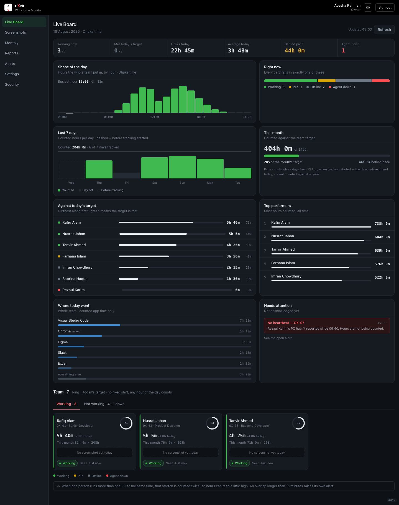

# oXeio Workforce Monitor

Self-hosted time tracking and screen monitoring for a small Windows office.
No SaaS, no per-seat fee, no third party holding your staff's screenshots — it
runs on one VPS you control.

Built for one real company (12 staff, Dhaka) and running in production since
August 2026. Open-sourced because the interesting part isn't the code — it's
the **hundred small decisions** about what a monitoring tool should refuse to do.

> **A note on language.** Code comments and the ten documents in `docs/` are
> written in **Bengali**. The user interface, commit subjects and this README are
> English. That's deliberate: the comments explain *why* a line exists, and they
> were written to be read by the people who maintain this.



<sub>The Live Board, running on demo data. Names are fictional; the numbers are
what the real dashboard computes. A day the server wasn't watching is the dashed
bar in *Last 7 days* — not a zero.</sub>

---

## What it refuses to do

Monitoring software earns trust by what it leaves out. These are not "not yet"
items — they were considered and **rejected**, and the reasons are in
[`docs/04-Features.md § L`](docs/04-Features.md) and
[`docs/05-Options-Decisions.md`](docs/05-Options-Decisions.md).

| Never | Why |
|---|---|
| **Keystroke logging** | Passwords and private messages would pass through it. There is no version of this that is safe to store. |
| **Reading screen content** | Screenshots are stored and shown, never OCR'd, classified, or searched. |
| **Webcam or microphone** | Not requested, not implemented, not wanted. |
| **Silent installation** | Staff agree to monitoring when they join, and the agent never hides: it shows a tray icon and a "My data" window. A policy [template](docs/monitoring-policy-template.md) ships with the repo for deployments that need a signed document. |
| **Hiding hours from the person who worked them** | Every employee can open their own page and see exactly what was recorded, including any manual correction the owner made and the reason for it. |
| **Screenshots outside 07:00–23:00** | Capture is time-boxed, and images auto-delete after 90 days. |
| **Approval workflows** | The owner can correct hours, but nobody has to ask permission to work. |

The one principle everything else follows: **a number must never claim to know
something it doesn't.** A day the server wasn't watching is drawn as a dotted
outline, not a zero bar. "Agent offline" and "person not working" are different
colours. This sounds obvious and is responsible for a surprising share of the
bugs in [`docs/08-Gap-Analysis.md`](docs/08-Gap-Analysis.md).

---

## How it fits together

```
Windows PC ×N                    one VPS
┌──────────────────┐            ┌─────────────────────────────┐
│ oXeio.Agent      │  HTTPS     │  Caddy ──┬── React dashboard│
│  · active/idle   │ ─────────► │          └── NestJS API     │
│  · screenshots   │  enroll    │              │              │
│  · app + domain  │  token     │          Postgres 16        │
│ oXeio.Watchdog   │            │              │              │
│  · restarts it   │            │          nightly backup     │
└──────────────────┘            └─────────────────────────────┘
```

- **Agent** — C# / .NET 8, three projects: `oXeio.Agent` (the service),
  `oXeio.Core` (rules, zero Win32 — so it's testable), `oXeio.Watchdog`.
  Queues to disk when the network drops and drains later; hours are never lost
  to a bad connection.
- **Server** — NestJS 11 + Prisma 6 + Postgres 16. 94 endpoints.
- **Dashboard** — React 19 + Vite 7 + Tailwind 4. Installable as a PWA.
- **Deploy** — Docker Compose + Caddy (automatic TLS). One `vps-update.sh`.

---

## The part that took the longest

Not the screenshots. **Deciding what "eight hours of work" means.**

There is no fixed shift — any active hour of the day counts. So the monthly
target is `workdays × 8h`, and *workdays* depends on a `holidays` table that the
owner edits — and, since the leave register landed, on who was away. Change one
holiday and every person's target, pace, and prorated salary fraction move. February 2026 is 20–24 workdays depending on what's in
that table; August is 25–27.

Getting one number to mean one thing across the tray app, the live board, the
monthly page, the reports, the daily email and the weekly Telegram summary took
three rounds of adversarial review to get right — and
[`docs/09-Build-Log.md`](docs/09-Build-Log.md) has the whole account of getting
it wrong first.

---

## Status

Running in production for one company. Honest state of things:

| | |
|---|---|
| **Tests** | Server **918** (no DB) + 222 e2e · Web **73** · Agent **303 facts / 128 cases** |
| **Proven in the field** | Agent capture and enrollment, screenshots, daily digest email, Telegram alerts, backups, auto-update, login rate limiting, fail2ban |
| **Built but never run for real** | Weekly Telegram summary · PWA install on a real phone · offsite backup and uptime monitoring (both wait on an account signup) |
| **Known gaps** | 19 open, all written down with reproduction and cost — [`docs/08-Gap-Analysis.md`](docs/08-Gap-Analysis.md) |

That third row is the one worth reading. This project keeps a standing list of
things that are *coded and tested but have never executed against reality*,
because the gap between those two states is where the expensive bugs live.

⚠️ **Not a product.** There's no multi-tenancy, no installer wizard, no support.
It is one company's internal tool, published in full. If you run it, you are
your own vendor.

---

## Running it

Requires Docker, and — if you build outside containers — Node 22+ (the
images use Node 24) and .NET 8 on Windows for the agent.

```bash
git clone https://github.com/ownCoder/oxeio-monitor.git
cd oxeio-monitor/oxeio-monitor
cp .env.example .env          # then edit — JWT_SECRET and passwords are placeholders
docker compose up -d
```

The dashboard is on `:8080`, or set `CADDY_SITE=your.domain` and Caddy fetches a
certificate itself. Full walkthrough, including the Windows agent and the
first-run checklist: [`oxeio-monitor/deploy/README.md`](oxeio-monitor/deploy/README.md).

**Tests.** They can't all run on one machine — the e2e suite needs Postgres, the
agent needs Windows:

```bash
cd oxeio-monitor/server && npm test     # needs Docker for Postgres
cd oxeio-monitor/web    && npm test
cd oxeio-monitor/agent  && dotnet test  # Windows
```

---

## Documentation

Ten documents in [`docs/`](docs/), all Bengali. The two worth opening even if you
don't read Bengali — the tables and code references carry most of the meaning:

| | |
|---|---|
| [`08-Gap-Analysis.md`](docs/08-Gap-Analysis.md) | Every known defect, why it's bad, when it will bite, what it costs to fix. Resolved ones stay, marked ✅. |
| [`09-Build-Log.md`](docs/09-Build-Log.md) | What broke and why, in order. Includes the bugs that only appeared in production. |

Also: [`04-Features.md`](docs/04-Features.md) (117 features, including the
rejected ones), [`05-Options-Decisions.md`](docs/05-Options-Decisions.md)
(architecture decisions with the discarded alternatives),
[`10-Roadmap.md`](docs/10-Roadmap.md).

---

## Legal and ethical use

Employee monitoring is regulated differently in every jurisdiction, and in many
places it requires disclosure, consent, or a works-council agreement. This
repository ships a
[monitoring policy template](docs/monitoring-policy-template.md) so you have
somewhere to start. In the original deployment, staff agree to monitoring as
part of joining, alongside the other terms of employment.

**Tell people.** Deploying this without the knowledge of those being monitored
is both wrong and, in many countries, illegal. Work out what your own
jurisdiction requires — written notice, a signature, a works council — and do
that. The software cannot enforce any of it for you, and it deliberately
does not try: `policy_signed_at` is a place to record a date, never a gate.

---

## Licence

[MIT](LICENSE) — use it, change it, ship it, sell it.

One thing MIT does **not** cover: the licence releases the copyright, not your
obligations to the people you monitor. Consent, disclosure and data-protection
law follow the deployment, not the code. See
[Legal and ethical use](#legal-and-ethical-use) above.
